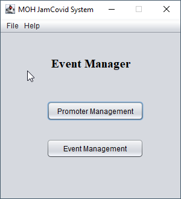
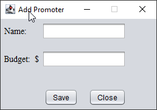
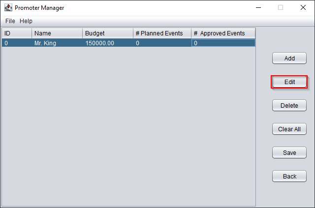
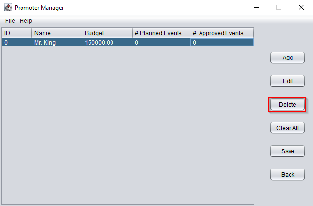
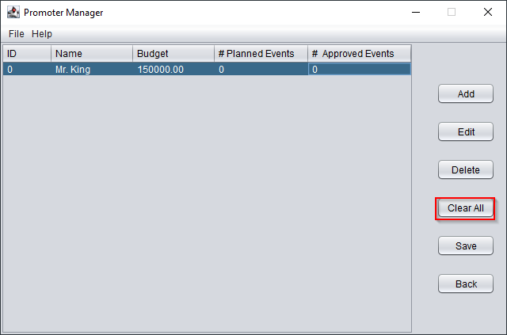
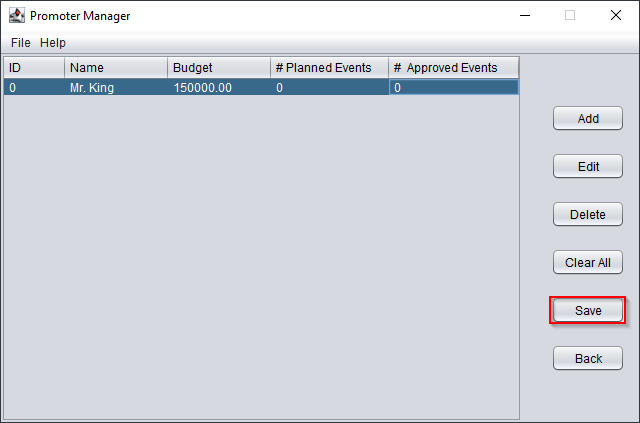
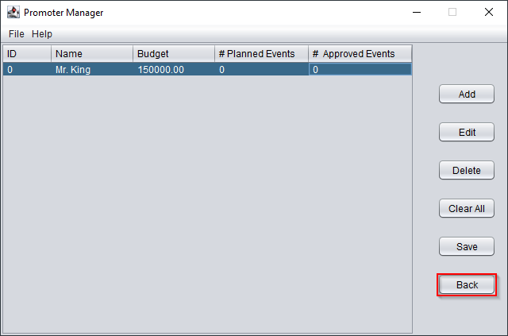

# Welcome to the JamCovid System

The JamCovid System is used to manage promoters and events

## Table of Contents

- Promoter Management
    -  Add
    -  Edit
    -  Delete
    -  Clear All
    -  Save
    -  Back
- Event Management
    -  Add
    -  Delete
    -  Invite
    -  Back

## Promoter Management

1. Select Promoter Mangement 

### Add

1. Select the add button and enter data

### Edit

1. Select the promoter you wish to edit
2. Click the edit button

### Delete

1. Select the promoter you wish to delete
2. Click the delete button

### Clear All

Removes all entry from the table

### Save

1. Click the save button or Ctrl-s to save entries

### Back

Navigates back to the mainpage

