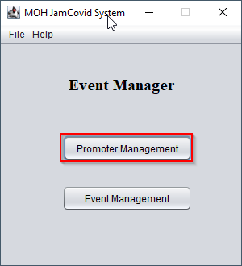
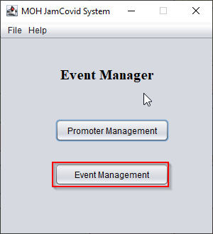
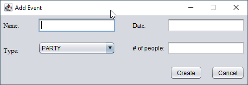
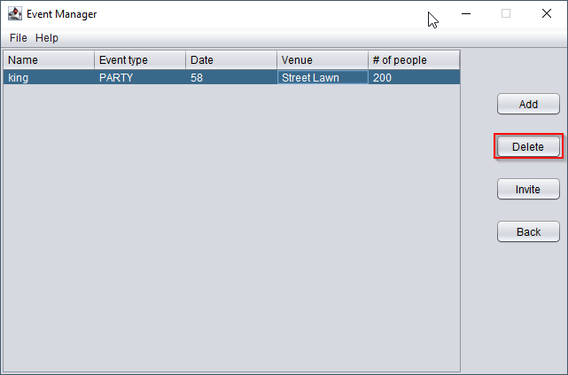
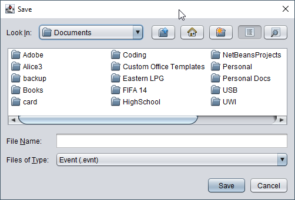
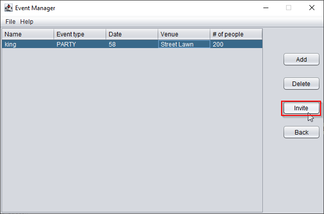
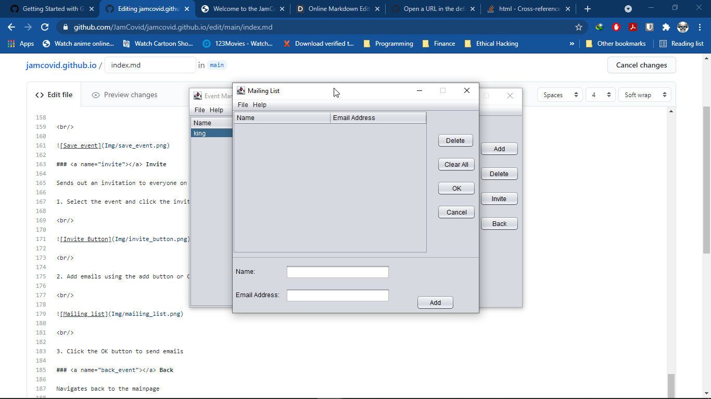
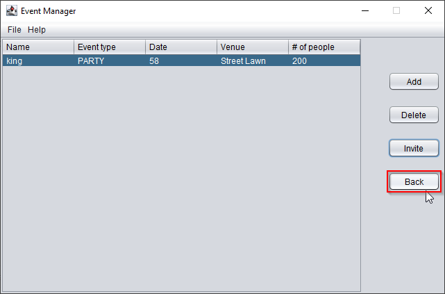

# Welcome to the JamCovid System

The JamCovid System is used to manage promoters and events

## Table of Contents

- Promoter Management
    -  [Add](#pookie)
    -  Edit
    -  Delete
    -  Clear All
    -  Save
    -  Back
- Event Management
    -  Add
    -  Delete
    -  Invite
    -  Back

##  Promoter Management

1. Select Promoter Mangement

 

 

### Add

1. Select the add button to add promoter or Ctrl-p to load data
 

 

 

### Edit

1. Select the promoter you wish to edit
2. Click the edit button

 

 

 

### Delete

1. Select the promoter you wish to delete
2. Click the delete button

 

 

### Clear All

Removes all entry from the table

 

 

### Save

1. Click the save button or Ctrl-s to save entries

 

 

### Back

Navigates back to the mainpage

 

 

 

 

 

## Event Management

1. Select Event Mangement

 

 

### Add

1. Select the add button and enter data

 

 

 

### Edit

1. Select the event you wish to edit
2. Click the edit button

 

 

 

### Delete

1. Select the event you wish to delete
2. Click the delete button

 

 

### Save

1. Click Ctrl-s to save entries

 

 

### Invite

Sends out an invitation to everyone on a mailing list.

1. Select the event and click the invite button

 

 

2. Add emails using the add button or Ctrl-m to load mailing list

 

 

3. Click the OK button to send emails

### Back

Navigates back to the mainpage

 

