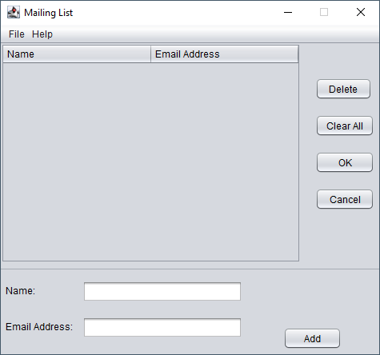

# Welcome to the JamCovid System

The JamCovid System is used to manage promoters and events

## Table of Contents

- Promoter Management
    -  [Add](#add_prom)
    -  [Edit](#edit_prom)
    -  [Delete](#del_prom)
    -  [Clear All](#clear_all)
    -  [Save](#save_prom)
    -  [Back](#back_prom)
- Event Management
    -  [Add](#add_event)
    -  [Delete](#del_event)
    -  [Save](#save_event)
    -  [Invite](#invite)
    -  [Back](#back_event)

## Promoter Management

1. Select Promoter Mangement

 

 

###  Add

1. Select the add button to add promoter or Ctrl-p to load data
 

 

 

###  Edit

1. Select the promoter you wish to edit
2. Click the edit button

 

 

 

###  Delete

1. Select the promoter you wish to delete
2. Click the delete button

 

 

###  Clear All

Removes all entry from the table

 

 

###  Save

1. Click the save button or Ctrl-s to save entries

 

 

###  Back

Navigates back to the mainpage

 

 

 

 

 

## Event Management

1. Select Event Mangement

 

 

###  Add

1. Select the add button and enter data

 

 

 

###  Edit

1. Select the event you wish to edit
2. Click the edit button

 

 

 

###  Delete

1. Select the event you wish to delete
2. Click the delete button

 

 

###  Save

1. Click Ctrl-s to save entries

 

 

###  Invite

Sends out an invitation to everyone on a mailing list.

1. Select the event and click the invite button

 

 

2. Add emails using the add button or Ctrl-m to load mailing list

 

 

3. Click the OK button to send emails

###  Back

Navigates back to the mainpage

 

